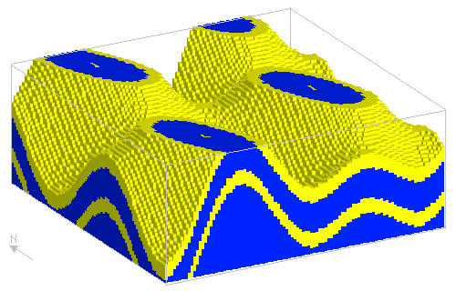
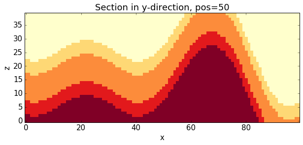

Reproducible Experiments with pynoddy
=====================

All `pynoddy` experiments can be defined in a Python script, and if all settings are appropriate, then this script can be re-run to obtain a reproduction of the results. However, it is often more convenient to encapsulate all elements of an experiment within one class. We show here how this is done in the `pynoddy.experiment.Experiment` class and how this class can be used to define simple reproducible experiments with kinematic models.


```python
from IPython.core.display import HTML
css_file = 'pynoddy.css'
HTML(open(css_file, "r").read())
```


<link href='http://fonts.googleapis.com/css?family=Alegreya+Sans:100,300,400,500,700,800,900,100italic,300italic,400italic,500italic,700italic,800italic,900italic' rel='stylesheet' type='text/css'>
<link href='http://fonts.googleapis.com/css?family=Arvo:400,700,400italic' rel='stylesheet' type='text/css'>
<link href='http://fonts.googleapis.com/css?family=PT+Mono' rel='stylesheet' type='text/css'>
<link href='http://fonts.googleapis.com/css?family=Shadows+Into+Light' rel='stylesheet' type='text/css'>
<link rel="stylesheet" type="text/css" href="http://fonts.googleapis.com/css?family=Tangerine">
<link href='http://fonts.googleapis.com/css?family=Philosopher:400,700,400italic,700italic' rel='stylesheet' type='text/css'>
<link href='http://fonts.googleapis.com/css?family=Libre+Baskerville:400,400italic' rel='stylesheet' type='text/css'>
<link href='http://fonts.googleapis.com/css?family=Lora:400,400italic' rel='stylesheet' type='text/css'>
<link href='http://fonts.googleapis.com/css?family=Karla:400,400italic' rel='stylesheet' type='text/css'>

<style>

@font-face {
    font-family: "Computer Modern";
    src: url('http://mirrors.ctan.org/fonts/cm-unicode/fonts/otf/cmunss.otf');
}

#notebook_panel { /* main background */
    background: #888;
    color: #f6f6f6;
}

div.cell { /* set cell width to about 80 chars */
    width: 800px;
}

div #notebook { /* centre the content */
    background: #fff; /* white background for content */
    width: 1000px;
    margin: auto;
    padding-left: 1em;
}

#notebook li { /* More space between bullet points */
margin-top:0.8em;
}

/* draw border around running cells */
div.cell.border-box-sizing.code_cell.running { 
    border: 3px solid #111;
}

/* Put a solid color box around each cell and its output, visually linking them together */
div.cell.code_cell {
    background: #ddd;  /* rgba(230,230,230,1.0);  */
    border-radius: 10px; /* rounded borders */
    width: 900px;
    padding: 1em;
    margin-top: 1em;
}

div.text_cell_render{
    font-family: 'Arvo' sans-serif;
    line-height: 130%;
    font-size: 115%;
    width:700px;
    margin-left:auto;
    margin-right:auto;
}


/* Formatting for header cells */
.text_cell_render h1 {
    font-family: 'Alegreya Sans', sans-serif;
    /* font-family: 'Tangerine', serif; */
    /* font-family: 'Libre Baskerville', serif; */
    /* font-family: 'Karla', sans-serif;
    /* font-family: 'Lora', serif; */
    font-size: 50px;
    text-align: center;
    /* font-style: italic; */
    font-weight: 400;
    /* font-size: 40pt; */
    /* text-shadow: 4px 4px 4px #aaa; */
    line-height: 120%;
    color: rgb(12,85,97);
    margin-bottom: .5em;
    margin-top: 0.1em;
    display: block;
}	
.text_cell_render h2 {
    /* font-family: 'Arial', serif; */
    /* font-family: 'Lora', serif; */
    font-family: 'Alegreya Sans', sans-serif;
    font-weight: 700;
    font-size: 24pt;
    line-height: 100%;
    /* color: rgb(171,165,131); */
    color: rgb(12,85,97);
    margin-bottom: 0.1em;
    margin-top: 0.1em;
    display: block;
}	

.text_cell_render h3 {
    font-family: 'Arial', serif;
    margin-top:12px;
    margin-bottom: 3px;
    font-style: italic;
    color: rgb(95,92,72);
}

.text_cell_render h4 {
    font-family: 'Arial', serif;
}

.text_cell_render h5 {
    font-family: 'Alegreya Sans', sans-serif;
    font-weight: 300;
    font-size: 16pt;
    color: grey;
    font-style: italic;
    margin-bottom: .1em;
    margin-top: 0.1em;
    display: block;
}

.text_cell_render h6 {
    font-family: 'PT Mono', sans-serif;
    font-weight: 300;
    font-size: 10pt;
    color: grey;
    margin-bottom: 1px;
    margin-top: 1px;
}

.CodeMirror{
        font-family: "PT Mono";
        font-size: 100%;
}

</style>


```python
%matplotlib inline
```


```python
# here the usual imports. If any of the imports fails, 
# make sure that pynoddy is installed
# properly, ideally with 'python setup.py develop' 
# or 'python setup.py install'
import sys, os
import matplotlib.pyplot as plt
import numpy as np
# adjust some settings for matplotlib
from matplotlib import rcParams
# print rcParams
rcParams['font.size'] = 15
# determine path of repository to set paths corretly below
repo_path = os.path.realpath('../..')
import pynoddy.history
import pynoddy.experiment
reload(pynoddy.experiment)
rcParams.update({'font.size': 15})
```

## Defining an experiment

We are considering the following scenario: we defined a kinematic model of a prospective geological unit at depth. As we know that the estimates of the (kinematic) model parameters contain a high degree of uncertainty, we would like to represent this uncertainty with the model.

Our approach is here to perform a randomised uncertainty propagation analysis with a Monte Carlo sampling method. Results should be presented in several figures (2-D slice plots and a VTK representation in 3-D).

To perform this analysis, we need to perform the following steps (see main paper for more details):

1. Define kinematic model parameters and construct the initial (base) model; 
2. Assign probability distributions (and possible parameter correlations) to relevant uncertain input parameters;
3. Generate a set of n random realisations, repeating the following steps: 
    1. Draw a randomised input parameter set from the parameter distribu- tion;
    2. Generate a model with this parameter set;
    3. Analyse the generated model and store results; 
4. Finally: perform postprocessing, generate figures of results

It would be possible to write a Python script to perform all of these steps in one go. However, we will here take another path and use the implementation in a Pynoddy Experiment class. Initially, this requires more work and a careful definition of the experiment - but, finally, it will enable a higher level of flexibility, extensibility, and reproducibility.


## Loading an example model from the Atlas of Structural Geophysics

As in the example for geophysical potential-field simulation, we will use a model from the Atlas of Structural Geophysics as an examlpe model for this simulation. We use a model for a fold interference structure. A discretised 3-D version of this model is presented in the figure below. The model represents a fold interference pattern of "Type 1" according to the definition of Ramsey (1967).



Instead of loading the model into a history object, we are now directly creating an experiment object:


```python
reload(pynoddy.history)
reload(pynoddy.experiment)

from pynoddy.experiment import monte_carlo
model_url = 'http://tectonique.net/asg/ch3/ch3_7/his/typeb.his'
ue = pynoddy.experiment.Experiment(url = model_url)
```

For simpler visualisation in this notebook, we will analyse the following steps in a section view of the model.

We consider a section in y-direction through the model:


```python
ue.write_history("typeb_tmp3.his")
```


```python
ue.write_history("typeb_tmp2.his")
```


```python
ue.change_cube_size(100)
ue.plot_section('y')
```





Before we start to draw random realisations of the model, we should first store the base state of the model for later reference. This is simply possibel with the freeze() method which stores the current state of the model as the "base-state":


```python
ue.freeze()
```

We now intialise the random generator. We can directly assign a random seed to simplify reproducibility (note that this is not *essential*, as it would be for the definition in a script function: the random state is preserved within the model and could be retrieved at a later stage, as well!):


```python
ue.set_random_seed(12345)
```

The next step is to define probability distributions to the relevant event parameters. Let's first look at the different events:


```python
ue.info(events_only = True)
```

    This model consists of 3 events:
    	(1) - STRATIGRAPHY
    	(2) - FOLD
    	(3) - FOLD
    


```python
ev2 = ue.events[2]
```


```python
ev2.properties
```


    {'Amplitude': 1250.0,
     'Cylindricity': 0.0,
     'Dip': 90.0,
     'Dip Direction': 90.0,
     'Pitch': 0.0,
     'Single Fold': 'FALSE',
     'Type': 'Sine',
     'Wavelength': 5000.0,
     'X': 1000.0,
     'Y': 0.0,
     'Z': 0.0}


Next, we define the probability distributions for the uncertain input parameters:


```python
param_stats = [{'event' : 2, 
              'parameter': 'Amplitude',
              'stdev': 100.0,
              'type': 'normal'},
              {'event' : 2, 
              'parameter': 'Wavelength',
              'stdev': 500.0,
              'type': 'normal'},
              {'event' : 2, 
              'parameter': 'X',
              'stdev': 500.0,
              'type': 'normal'}]

ue.set_parameter_statistics(param_stats)
```


```python
resolution = 100
ue.change_cube_size(resolution)
tmp = ue.get_section('y')
prob_4 = np.zeros_like(tmp.block[:,:,:])
n_draws = 100


for i in range(n_draws):
    ue.random_draw()
    tmp = ue.get_section('y', resolution = resolution)
    prob_4 += (tmp.block[:,:,:] == 4)

# Normalise
prob_4 = prob_4 / float(n_draws)
```


```python
fig = plt.figure(figsize = (12,8))
ax = fig.add_subplot(111)
ax.imshow(prob_4.transpose()[:,0,:], 
           origin = 'lower left',
           interpolation = 'none')
plt.title("Estimated probability of unit 4")
plt.xlabel("x (E-W)")
plt.ylabel("z")
```


    <matplotlib.text.Text at 0x10ba80250>


This example shows how the base module for reproducible experiments with kinematics can be used. For further specification, child classes of `Experiment` can be defined, and we show examples of this type of extension in the next sections.


```python

```
